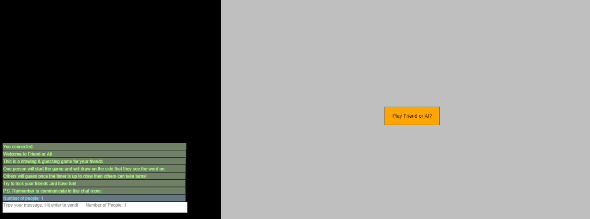
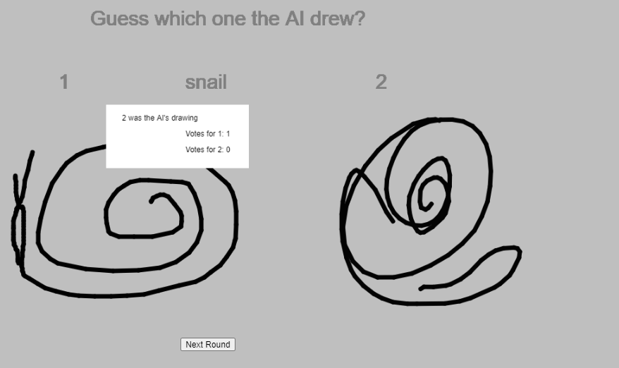

# Friend or AI?

### What is it?

A web-application inspired by a popular quarantine drawing game, scribbl.io. <i> Friend or AI? </i> is a drawing and 
guessing game that includes a chat feature at the side to allow for real time communication with your friends!

### How it Works?
The main part of the game is for each user to draw the prompt (a word/object) that is given to them and draw it on the 
left hand side. While you are drawing, you get 10 seconds and the game retrieves an image that was stored in Google
Quick Draw's database. Through that it was able to recognize what a person was drawing with their Artificial Intelligence.

##### Libraries/Tools Used:

- Node.js
- Socket.io
- p5.js
- ml5.js
- Express

## Images

<b>Main Screen:</b>

<b>Chat Feature:</b> 

<b>For the person who is drawing:</b>

<b>For the person who is guessing:</b>

<b>Vote Results:</b>

